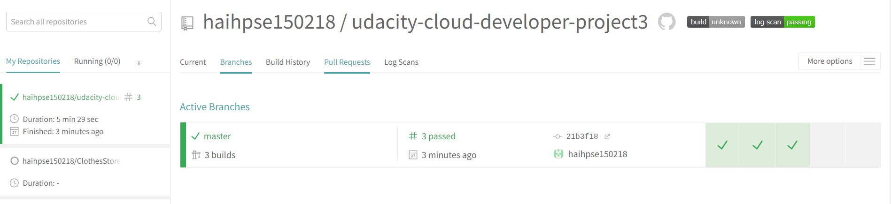
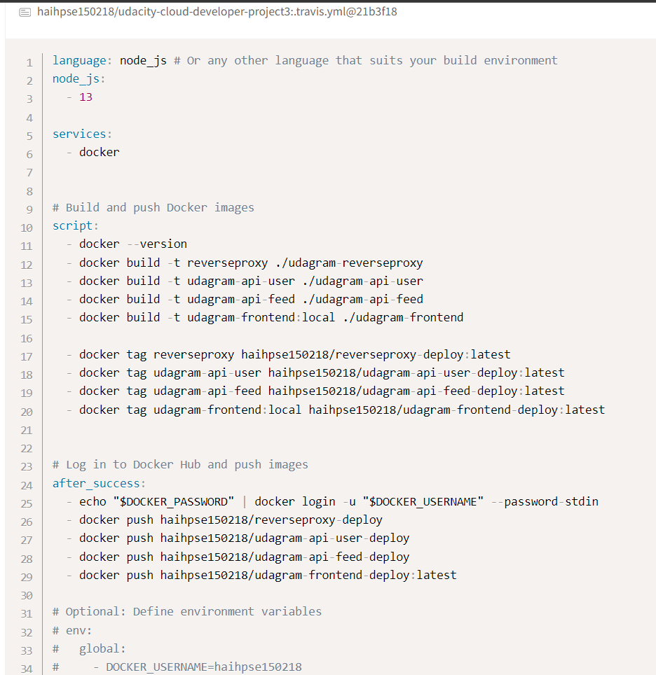
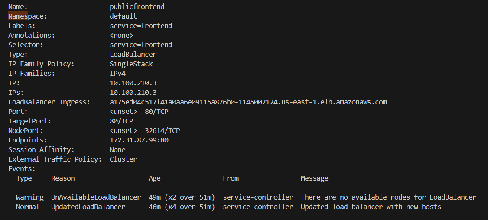

# 1. DockerHub showing images that you have pushed

# 2. Travis CI showing a successful build job

# Kubernetes
## kubectl get pods

## kubectl describe services

## To verify that you have horizontal scaling set against CPU usage

    **Im test spam:**

## To verify that you have set up logging with a backend application

# Run My App:
Link: http://a175ed04c517f41a0aa6e09115a876b0-1145002124.us-east-1.elb.amazonaws.com/
