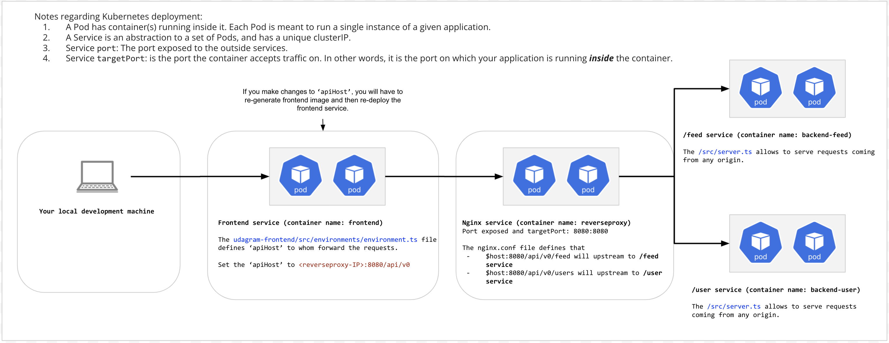

+-----------------------------------------+
|                 Client                  |
|            (Browser or App)            |
+-------------------+---------------------+
                    |
                    | HTTP Requests
                    |
                    v
+-------------------+----------------------------+
|                   Nginx                        |
|               (Reverse Proxy Configuration)    |
|  +----------------------+-------------------+  |
|  |  /api/v0/feed        |   /api/v0/users   |  |
|  |   Proxy Pass         |   Proxy Pass      |  |
|  |-> backend-feed:8080  |-> backend-user:8080  |
|  +----------------+-------------------------+  |
+-------------------+-------------------------+
                    |
                    | HTTP Requests
                    |
                    v
+-------------------+---------------------+
|          Backend Services               |
|  +----------------+-------------------+  |
|  | Backend Feed   |  Backend User    |  |
|  |   (e.g., API)  |   (e.g., Auth)   |  |
|  +----------------+-------------------+  |
+-----------------------------------------+

# Step 1. Create the EKS Cluster
Cluster Service Role:
AmazonEKSClusterPolicy
AmazonEC2ContainerServiceFullAccess
AmazonEKSServicePolicy

# Step 2. Create the EKS Node Groups
create an AWS role for EKS Node:
AmazonEKSWorkerNodePolicy
AmazonEC2ContainerRegistryReadOnly
AmazonEKS_CNI_Policy
# Step 3. Connecting kubectl with EKS

    aws sts get-caller-identity
    aws eks update-kubeconfig --name project-3 --region us-east-1
    kubectl autoscale deployment <NAME> --cpu-percent=<CPU_PERCENTAGE>                --min=<MIN_REPLICAS>
--max=<MAX_REPLICAS>
    
    kubectl get hpa

To simulate how we may process concurrent logs, an exercise has been prepared for you: debugging-logs(opens in a new tab).

We will want to connect to the running container and run a script name make_requests.sh to simulate concurrent requests. By connecting to the running container to run the script, we guarantee that the script can be run properly regardless of what operating system we are using locally.
https://github.com/udacity/cd0354-monolith-to-microservices-exercises/tree/main/lesson-6-kubernetes-for-production/exercises/debugging-logs

